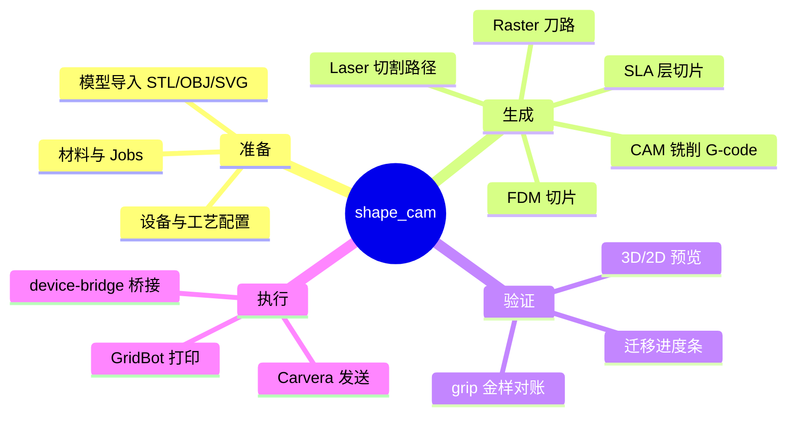
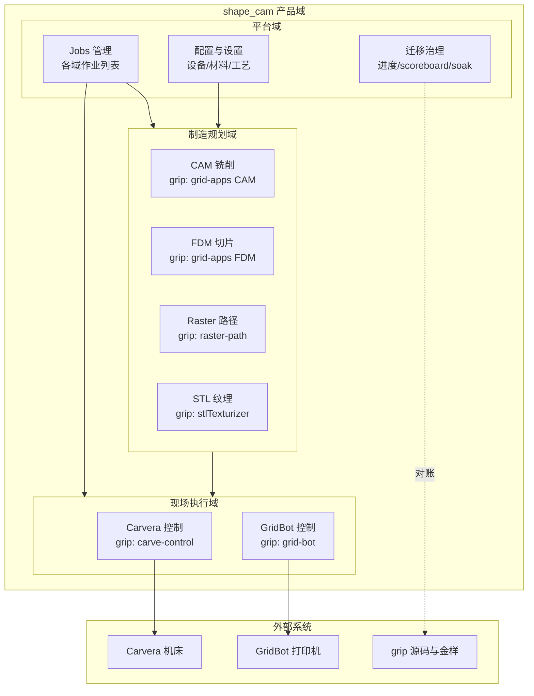
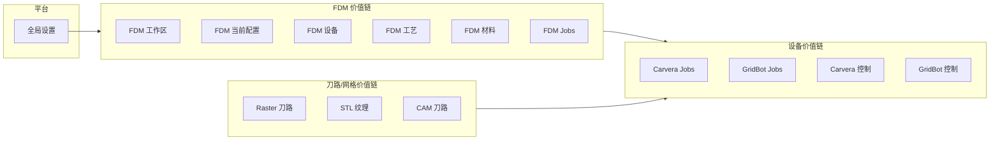
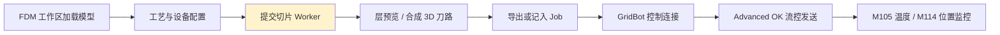
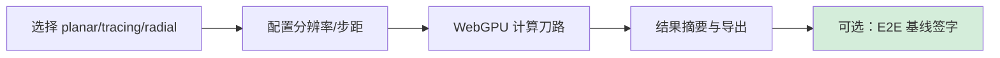
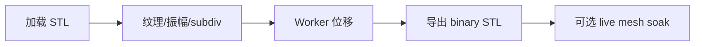
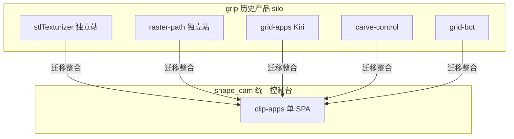
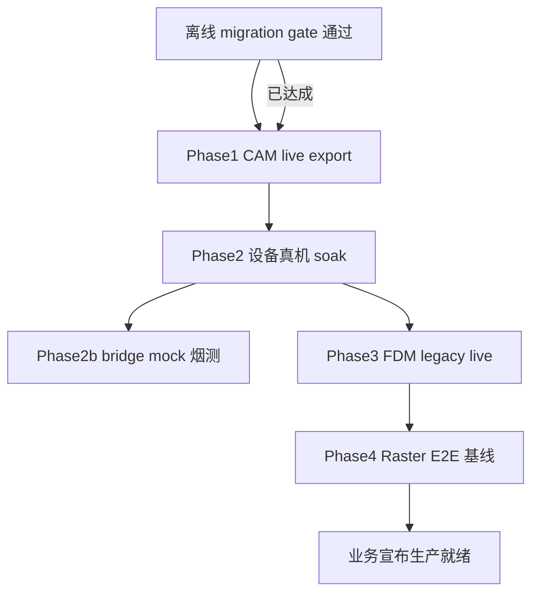
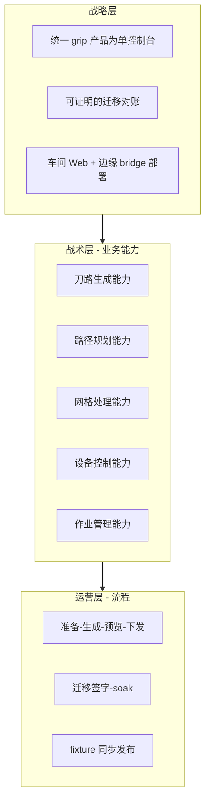
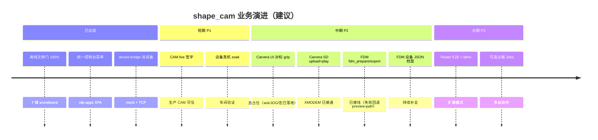

# shape_cam 业务架构

> **范围**：迁移后产品 `shape_cam` 的业务域划分、用户价值、流程与 grip 血统映射。  
> **读者**：产品、工艺、实施与研发；技术实现细节见 [TECHNICAL-ARCHITECTURE.md](./TECHNICAL-ARCHITECTURE.md)。

---

## 1. 产品定位

**shape_cam（clip-apps）** 是将原 **grip 多独立 Web 应用** 收敛为 **单一管理控制台** 后的制造软件套件，主产品线覆盖：

- **桌面激光切割**：独立 Laser（Kiri `mode/laser`）
- **CNC**：CAM 铣削刀路
- **增材**：**FDM + SLA**（树脂光固化）
- **扩展**：Raster、Texturizer、Carvera / GridBot 现场执行

业务目标：**在同一浏览器会话中完成「准备 → 生成刀路/路径 → 预览 → 下发设备」**，并以迁移门保证与 grip 行为可回归对账。

---

## 2. 利益相关方与角色

| 角色 | 目标 | 主要使用模块 |
|------|------|----------------|
| **工艺工程师** | 可重复刀路、与历史 grip 一致 | CAM、Raster、FDM 工艺页 |
| **CNC 操作员** | 连机、看状态、发 G-code | Carvera 控制、Carvera Jobs |
| **增材操作员** | 切片预览、送打印机 | FDM 工作区、GridBot 控制 |
| **表面处理工程师** | STL 纹理与导出 | Texturizer |
| **实施 / IT** | 部署 bridge、fixture 同步 | device-bridge、迁移脚本 |
| **QA / 迁移负责人** | 门禁通过、soak 签字 | migration gates、SOAK |

---

## 3. 业务域地图（Bounded Contexts）

### 3.1 域能力矩阵

| 业务域 | 核心能力（已实现） | 业务未完成 / 可选深化 |
|--------|-------------------|------------------------|
| **CAM** | Legacy 刀路、G-code 预览、**STL/OBJ 工件导入**、**库存机床 ~28 台**、**Animate**、**laser on/off op** | live export 签字 |
| **FDM** | 切片/export、设备 ~58、gyroid/vase、支撑、belt、Animate、dual-extruder、paint densify | 真机 soak；paint shader |
| **Laser** | `/laser` shell + **TS MVP** SVG/DXF→nest→G-code + 库存设备 + 金样 SHA | vendor laser worker、完整 nest/pack、HW-08 |
| **SLA** | `/sla` shell + mesh→Photon/CTB/GOO MVP + 层 scrub + 金样 SHA | vendor sla worker、完整 ChiTu crypto / Elegoo GOO、HW-09 |
| **Raster** | planar / tracing / radial、WebGPU、基线参数、**radial V3（lathe 向）** UI+桥接 | 真 lathe V4 / workload；浏览器 E2E 基线 |
| **Texturizer** | subdiv、位移、binary STL 导出、离线金样 | 生产 STL live soak |
| **Carvera** | WS 连接、状态解析 L/W/A/H、Jobs、3D 机模、ack 门控发送、A 轴 JOG、WCS 置零、覆写滑条、**SD upload+play（XMODEM）**、**SD 文件浏览/播放/删除**、**M495 探针/调平向导** | 真机 soak / 探针结果可视化 |
| **GridBot** | M105/M114、Advanced OK、发送队列、**暂停 park / 取消关断 / 急停**、温控设定、JOG、checksum、FDM 宏、进给覆写 | 服务端文件 spool（`*kick`）不在产品范围 |
| **Jobs** | FDM/Carvera/GridBot 列表与本地持久化 | 无集中服务端 Job 仓库 |
| **迁移治理** | Scoreboard 100% 离线门、有序管线文档 | Live soak 需现场签字 |

---

## 4. 产品线与菜单结构（业务入口）

控制台侧栏（`MainLayout.vue`）对应 **8 条业务价值链 + 平台项**：

| 路由 | 业务名称 | 价值链阶段 |
|------|----------|------------|
| `/settings` | 全局设置 | 平台 |
| `/fdm` … `/material/fdm` | FDM 准备 | 增材规划 |
| `/jobs/fdm` | FDM Jobs | 增材作业管理 |
| `/cam` | CAM / CNC 刀路 | 减材规划 |
| `/laser` | 桌面激光切割 | 2D 切割规划 |
| `/sla` | SLA 树脂 | 光固化规划 |
| `/raster` | Raster 刀路 | 2.5D 规划 |
| `/texturizer` | STL 纹理 | 表面处理规划 |
| `/jobs/carvera` | Carvera Jobs | 减材执行准备 |
| `/jobs/gridbot` | GridBot Jobs | 增材执行准备 |
| `/carvera` | Carvera 控制 | 减材执行 |
| `/gridbot` | GridBot 控制 | 增材执行 |

---

## 5. 端到端业务流（价值流）

### 5.1 减材：CAM → Carvera

> **业务注记**：步骤 A7 支持 **ack 逐行发送** 与 **SD upload+play（XMODEM）** 双路径；mock bridge 可离线验证上传进度与 `|P:` 播放状态。

### 5.2 增材：FDM → GridBot

> **业务注记**：B3 在 legacy 加载后走 `fdm_slice` → `fdm_prepare` → `fdm_export`；失败时回退 preview-path G-code。

### 5.3 2.5D：Raster 独立交付

### 5.4 表面处理：Texturizer

---

## 6. grip → shape_cam 业务血统

| grip 原产品 | shape_cam 业务域 | 用户可见入口 | 迁移状态（业务语义） |
|-------------|------------------|--------------|----------------------|
| grid-apps（CAM） | CAM 刀路 | `/cam` | 离线对账完成；live 导出待签字 |
| grid-apps（FDM） | FDM 全链 | `/fdm` 等 | 壳 + 门完成；真切片 parity 待强化 |
| raster-path-main | Raster | `/raster` | 主模式已交付；lathe 等未纳入 |
| stlTexturizer-main | STL 纹理 | `/texturizer` | 主流程已交付 |
| carve-control-main | Carvera | `/carvera` | 协议/预览已迁；控制台深度不足 |
| grid-bot-master | GridBot | `/gridbot` | sender UX 已加深（park/急停/温控/JOG）；无 Pi 服务端 spool |
| app-server 等 | （无独立菜单） | 迁移门 only | 业务未提供托管服务 |
| wattzup / basic-ftp | — | — | **不纳入产品范围** |

---

## 7. 业务规则与策略

### 7.1 Legacy 启用策略（影响业务可用性）

| 标志 | 业务影响 |
|------|----------|
| `VITE_KIRI_LEGACY_CAM` | 控制是否加载真实 CAM 引擎；`0` 时仅能演示/placeholder |
| `VITE_KIRI_LEGACY_FDM` | 控制 FDM 真切片；未加载则显示合成刀路 |
| `VITE_RASTER_GRIP_BRIDGE` | planar/tracing/radial 走 grip 一致算法 |

### 7.2 设备连接规则

- 默认端点：`ws://localhost:9999/carvera` 与 `/gridbot`（需本地 **device-bridge**）。
- 生产：`CARVERA_BACKEND=tcp` + `CARVERA_TCP=ip:port` 指向真实控制器。
- **业务约束**：bridge 不替代 MES/ERP；仅作指令与状态行转发。

### 7.3 Jobs 与数据主权

- Jobs **保存在浏览器 localStorage**，不跨设备同步。
- **业务含义**：适合单机/demo/车间单站；多用户协作需后续服务端 Jobs（当前未迁移）。

### 7.4 迁移签字流程（治理域）

有序管线（业务验收顺序，见 `SOAK.md`）：

| 阶段 | 业务验收标准 |
|------|----------------|
| 离线门 | 与 grip 金样/协议一致，CI 可重复 |
| CAM live | 真机 WASM 导出与 capture 指纹一致 |
| 设备 soak | 实机 `?`/温度/Advanced OK 稳定 |
| FDM live | legacy slice 非 placeholder |
| Raster E2E | 浏览器 planar checksum 通过 |

---

## 8. 业务架构分层（BMM 风格）

---

## 9. 业务场景（用例摘要）

| ID | 场景 | 主成功路径 | 扩展/异常 |
|----|------|------------|-----------|
| UC-CAM-01 | 生成铣削 G-code | Legacy 跑通 → 预览匹配金样 | Legacy 不可用 → placeholder + 提示 |
| UC-FDM-01 | FDM 切片预览 | Worker 返回层 | Legacy 缺失 → 合成刀路演示 |
| UC-RAS-01 | Planar 刀路 | grip bridge + WebGPU | GPU 不可用 → 错误提示 |
| UC-TEX-01 | 纹理 STL 导出 | subdiv + 位移 + 下载 STL | 超大 mesh → 超时配置 |
| UC-CV-01 | Carvera 监视 | 连接 bridge → `?` 解析状态 | 断线 → store 重连策略 |
| UC-CV-02 | Carvera 发 Job | 逐行发送队列 | UI 占位；需人工确认发送完成 |
| UC-GB-01 | GridBot 打印 | Ack 队列 + B/P 流控 | Resend/timeout 恢复 |
| UC-MIG-01 | 发布迁移版本 | test:migration + migration:gates | live soak 清单逐项 env 执行 |

---

## 10. 业务 KPI 建议（迁移后运营）

| KPI | 说明 | 数据来源 |
|-----|------|----------|
| 迁移门通过率 | `test:migration` 绿 | CI |
| 域 scoreboard | strictTotal 100% | `migration:report` |
| Live 签字完成率 | 4 阶段 soak 完成项 | SOAK 清单 |
| CAM 导出一致率 | live spec fingerprintMatch | `soak:cam:live` |
| 设备 soak 成功率 | carveraOk / gridbotOk | production soak |
| 用户作业留存 | localStorage jobs 数 | 客户端（可选遥测） |

---

## 11. 不在范围（业务边界）

以下 ** deliberately 不作为 shape_cam 产品承诺**：

1. **wattzup** 功耗分析工具链  
2. **basic-ftp** 文件传输库产品化  
3. **完整 app-server** 多租户托管与 Connect 压缩生产协商  
4. **Raster lathe / workload 标定**（grip 有、控制台无菜单）  
5. **跨浏览器 Jobs 云同步**（无后端 Job 服务）  
6. **MES/ERP 集成**（需另行集成项目）

---

## 12. 业务演进路线图（建议）

---

## 13. 相关文档

| 文档 | 说明 |
|------|------|
| [OPERATIONS.md](./OPERATIONS.md) | 运行步骤与功能验证对照表 |
| [TECHNICAL-ARCHITECTURE.md](./TECHNICAL-ARCHITECTURE.md) | 组件、Worker、bridge、数据流 |
| [KIRI-MIGRATION-GAP.md](./KIRI-MIGRATION-GAP.md) | Kiri-Moto ↔ shapexcam 能力差距与迁移优先级 |
| `clip-apps/SOAK.md` | Live 验收命令与环境变量 |
| `clip-apps/src/core/migration/migrationProgressScoreboard.ts` | 域权重与 remaining 文案 |

---

*业务架构随产品范围变更而更新；新增 grip 包纳入流前请先更新 `gripOutOfScopeInventory` 与 scoreboard。*
