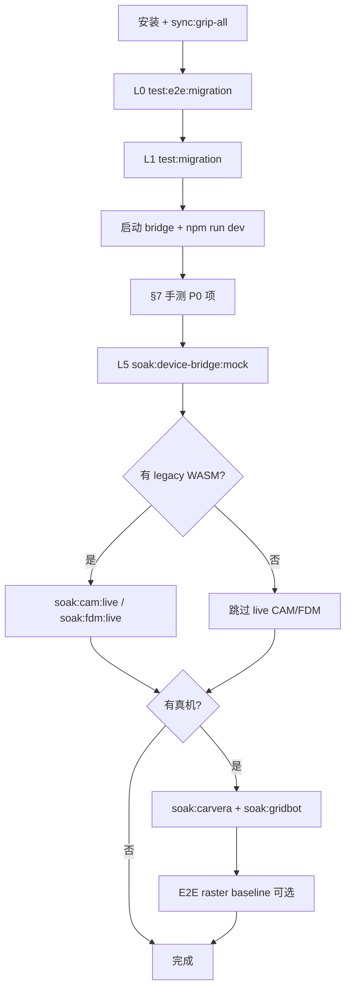

# shape_cam 操作与功能验证手册

> **项目路径**：`F:\CAM\chip\shape_cam`  
> **用途**：本地运行步骤 + **功能对照表**（可逐项打勾验收）。  
> **Excel/表格验收**：[`OPERATIONS-checklist.csv`](./OPERATIONS-checklist.csv)（可用 Excel、WPS、Numbers 打开，筛选 `priority`/`status`）  
> **相关文档**：[技术架构](./TECHNICAL-ARCHITECTURE.md) · [业务架构](./BUSINESS-ARCHITECTURE.md) · [SOAK 手册](../clip-apps/SOAK.md)

---

## 1. 项目组成

| 子项目 | 路径 | 作用 |
|--------|------|------|
| **clip-apps** | `shape_cam/clip-apps` | Vue 3 管理台（浏览器） |
| **device-bridge** | `shape_cam/device-bridge` | WebSocket 桥（Carvera / GridBot） |
| **grip 依赖** | `F:\CAM\chip\grip` | 上级目录：fixture、WASM、raster 核心源码 |

---

## 2. 环境要求

| 项 | 要求 |
|----|------|
| **Node.js** | `^20.19` 或 `>=22.12`（见 `clip-apps/package.json` engines） |
| **npm** | 随 Node 安装即可 |
| **浏览器** | Chromium 系（Chrome / Edge），**Raster 需 WebGPU** |
| **OS** | 本文示例为 **Windows PowerShell** |
| **可选** | Playwright 浏览器（E2E）：`npx playwright install chromium` |

---

## 3. 首次安装

### 3.1 安装依赖

```powershell
cd F:\CAM\chip\shape_cam\clip-apps
npm install

cd F:\CAM\chip\shape_cam\device-bridge
npm install
```

### 3.2 同步 grip 资源（推荐）

```powershell
cd F:\CAM\chip\shape_cam\clip-apps

# 一键：raster fixture + wasm + carvera 模型
npm run sync:grip-all

# 或分项
npm run sync:grip-fixtures
npm run sync:grip-wasm
npm run sync:grip-carvera-assets
npm run sync:verify
```

### 3.3 前端环境变量

复制并调整（仓库已含 `.env.development` 可参考）：

```powershell
copy F:\CAM\chip\shape_cam\clip-apps\.env.example F:\CAM\chip\shape_cam\clip-apps\.env.local
```

| 变量 | 推荐开发值 | 作用 |
|------|------------|------|
| `VITE_KIRI_LEGACY_CAM` | `1` | 加载真实 CAM legacy（否则 placeholder） |
| `VITE_KIRI_LEGACY_FDM` | `auto` 或 `1` | FDM legacy 切片 |
| `VITE_RASTER_GRIP_BRIDGE` | `1` | planar/radial 走 grip 算法 |
| `VITE_KIRI_LEGACY_SLICE_TIMEOUT_MS` | `30000` | 切片超时（可选） |

---

## 4. 日常运行（开发模式）

需要 **两个终端**：device-bridge + clip-apps。

### 4.1 终端 A — device-bridge

```powershell
cd F:\CAM\chip\shape_cam\device-bridge
npm run dev
```

成功标志：

```text
[device-bridge] ws://localhost:9999/carvera
[device-bridge] ws://localhost:9999/gridbot
```

**说明**：若提示端口 9999 被占用，结束旧进程或：

```powershell
$env:PORT = '19999'
npm run dev
```

并在 clip-apps 里把 Carvera/GridBot 连接地址改为 `ws://localhost:19999/carvera` 等。

**连接真机（可选）**：

```powershell
$env:CARVERA_BACKEND = 'tcp'
$env:CARVERA_TCP = '192.168.1.100:3001'   # 改为你的控制器 IP:端口
$env:GRIDBOT_BACKEND = 'tcp'
$env:GRIDBOT_TCP = '192.168.1.50:23'
npm run dev
```

### 4.2 终端 B — clip-apps

```powershell
cd F:\CAM\chip\shape_cam\clip-apps
npm run dev
```

浏览器打开 Vite 提示地址（通常 **http://localhost:5173**）。

### 4.3 生产构建预览（可选）

```powershell
cd F:\CAM\chip\shape_cam\clip-apps
npm run build
npm run preview
```

---

## 5. 界面导航速查

| 菜单 | 路由 | 业务 |
|------|------|------|
| 全局设置 | `/settings` | 单位、主题、缩放 |
| FDM 工作区 | `/fdm` | 模型、切片、预览 |
| FDM 当前配置 | `/config/fdm` | 配置总览 |
| FDM 设备 / 工艺 / 材料 | `/devices/fdm` 等 | FDM 元数据 |
| FDM Jobs | `/jobs/fdm` | 作业列表 |
| CAM 刀路 | `/cam` | 铣削 CAM |
| Laser 切割 | `/laser` | 桌面激光 |
| SLA 树脂 | `/sla` | 光固化 |
| Raster 刀路 | `/raster` | 2.5D 路径 |
| STL 纹理 | `/texturizer` | 网格位移 |
| Carvera Jobs | `/jobs/carvera` | G-code 作业库 |
| GridBot Jobs | `/jobs/gridbot` | G-code 作业库 |
| Carvera 控制 | `/carvera` | 雕刻机 |
| GridBot 控制 | `/gridbot` | 打印机 |

顶栏 **MigrationProgressBar** 显示迁移进度（开发态）。

---

## 6. 自动化测试分层（建议验收顺序）

按 **由易到难** 执行；全部通过后再做真机 live。

| 层级 | 命令 | 说明 | 预计 |
|------|------|------|------|
| **L0 冒烟** | `npm run test:e2e:migration` | 各工作区页面按钮可见 | 需 dev 或 preview |
| **L1 迁移门** | `npm run test:migration` | ~1141 条，不含 `*.live.spec.ts` | 1–2 min |
| **L2 产品门** | `npm run migration:gates` | 7 域 + FDM + bridge + bootstrap | 短 |
| **L3 离线 soak** | `npm run soak:offline` | 各 `*MigrationComplete` | 短 |
| **L4 有序管线离线** | `npm run migration:ordered:offline` | 六阶段离线检查（含 laser/sla soak） | 短 |
| **L5 Bridge mock** | `npm run soak:device-bridge:mock` | 无真机 WS 烟测 | ~15s |
| **L6 Live** | 见 §7 各模块「自动化」列 | 需 env + 真机/legacy | 按需 |
| **L7 E2E 基线** | `npm run test:e2e:raster-baseline` | 浏览器 planar 基线 | 需 build/ dev |
| **CI 一键** | `npm run migration:ci` | 脚本化 CI 组合 | — |

**迁移进度报告**：

```powershell
cd F:\CAM\chip\shape_cam\clip-apps
npm run migration:report
```

**快速清单打印**：

```powershell
npm run migration:quickstart
```

---

## 7. 功能验证对照表（主表）

**列说明**：

- **ID**：验收编号，便于跟踪缺陷  
- **手动步骤**：在浏览器中操作  
- **预期**：通过标准  
- **自动化**：可代替或补充手测的命令  
- **优先级**：P0 必测 · P1 建议 · P2 可选/真机  

**状态**：在 `[ ]` 中打 `x` 表示完成：`[x]`  
**CSV**：同上表已导出为 [`OPERATIONS-checklist.csv`](./OPERATIONS-checklist.csv)，列 `status` 建议填 `pass` / `fail` / `skip` / `pending`。

---

### 7.0 平台与公共

| ID | 功能 | 路由/位置 | 手动步骤 | 预期 | 自动化 | 级 |
|----|------|-----------|----------|------|--------|-----|
| P-01 | 应用启动 | — | `npm run dev` 打开首页 | 无白屏，侧栏菜单完整 | `npm run test:e2e:migration` | P0 |
| P-02 | 全局设置保存 | `/settings` | 改「单位/深色」→ 保存 → 刷新 | 设置保留 | — | P1 |
| P-03 | 迁移进度条 | 顶栏 | 打开任意页 | 显示 scoreboard 百分比 | `npm run migration:report` | P1 |
| P-04 | grip 资源同步 | — | `npm run sync:grip-all` | 无报错；`public/grip-raster-fixtures` 存在 | `npm run sync:verify` | P0 |
| P-05 | 迁移门全绿 | — | 在 clip-apps 目录执行 | Vitest 全通过 | `npm run test:migration` | P0 |
| P-06 | 产品门全绿 | — | — | gates `allOk` | `npm run migration:gates` | P0 |

| 状态 |
|------|
| P-01 `[ ]` P-02 `[ ]` P-03 `[ ]` P-04 `[ ]` P-05 `[ ]` P-06 `[ ]` |

---

### 7.1 CAM 刀路（`/cam`）

| ID | 功能 | 手动步骤 | 预期 | 自动化 | 级 |
|----|------|----------|------|--------|-----|
| CAM-01 | 页面加载 | 进入 CAM | 「生成 CAM 刀路」「对比金样 motion」可见 | `test:e2e:migration` | P0 |
| CAM-02 | 加载示例配置 | 「加载示例配置」 | device/process/tools 有值 | — | P0 |
| CAM-03 | 导入工件 STL | 「导入工件 STL」选 STL | 预览区有几何 | — | P1 |
| CAM-04 | 工艺配置 | 编辑 Stock/Z/速度、ops 列表 | 表单可改，ops 可选中 | — | P1 |
| CAM-05 | 生成 CAM 刀路 | 「生成 CAM 刀路（Legacy）」 | 进度条走完；有 G-code；legacy 标签非 error | `npm run test:cam` | P0 |
| CAM-06 | G-code 预览 | 生成后看中央预览 | 可见 G0/G1 折线 | — | P0 |
| CAM-07 | grip 金样预览 | 「grip 金样预览」 | 预览有内容 | — | P1 |
| CAM-08 | 对比金样 motion | 「对比金样 motion」 | 提示 match 或显示 diff 信息 | — | P1 |
| CAM-09 | 复制/下载 G-code | 「复制」「下载」 | 剪贴板/文件含 G-code | — | P1 |
| CAM-10 | 保存到 Carvera Job | 「保存到 Carvera」 | `/jobs/carvera` 或 Carvera 作业列表出现 | — | P1 |
| CAM-11 | 保存到 GridBot Job | 「保存到 GridBot」 | GridBot Jobs 出现 | — | P2 |
| CAM-12 | 导入/导出 JSON | 导出 → 重置 → 导入 | 配置恢复 | — | P1 |
| CAM-13 | 会话包/预览设置 | 导入会话包、导出预览设置 | JSON 可导出可再导入 | — | P2 |
| CAM-14 | Legacy 健康 | 看 Legacy 桥接提示条 | `VITE_KIRI_LEGACY_CAM=1` 时为 ready | `npm run soak:cam:live`（需 legacy） | P1 |

| 状态 |
|------|
| CAM-01~06 `[ ]` CAM-07~14 `[ ]` |

---

### 7.2 FDM 工作区（`/fdm` 及子页）

| ID | 功能 | 路由 | 手动步骤 | 预期 | 自动化 | 级 |
|----|------|------|----------|------|--------|-----|
| FDM-01 | 工作区加载 | `/fdm` | 打开 FDM | 「切片」按钮可见 | `test:e2e:migration` | P0 |
| FDM-02 | 导入模型 | `/fdm` | 「导入模型文件」 | 模型列表增加 | — | P0 |
| FDM-03 | 切片 | `/fdm` | 选模型 →「切片」 | `sliceResult` 有层数；摘要显示 | — | P0 |
| FDM-04 | 层预览 | `/fdm` | 拖动层滑块 | 2D canvas 变化 | — | P1 |
| FDM-05 | 3D 刀路示意 | `/fdm` | 切片后 | GcodePreviewPanel 有折线 | — | P1 |
| FDM-06 | 导出 G-code | `/fdm` | 「导出 G-code」 | 下载 `.gcode` | — | P1 |
| FDM-07 | 送到 Carvera/GridBot | `/fdm` | 两个绿色按钮 | Jobs 中新增记录 | — | P2 |
| FDM-08 | 切片后端切换 | `/fdm` 侧栏 | 切换 mock/kiri | 摘要中后端字段变化 | `npm run soak:fdm:live` | P1 |
| FDM-09 | Legacy 对账包 | `/fdm` | 「复制对账包」 | 剪贴板含 `fdmLegacyComparison` | `fdmLegacyMigrationComplete` 在 `test:migration` | P1 |
| FDM-10 | 设备/工艺/材料页 | `/devices/fdm` 等 | 打开各子页 | 列表可浏览（占位数据可接受） | — | P2 |
| FDM-11 | FDM Jobs | `/jobs/fdm` | 打开列表 | 可看到已保存作业 | — | P2 |
| FDM-12 | Kiri PoC | `/fdm` | 「Kiri PoC」 | 有响应或明确错误 | — | P2 |
| FDM-13 | 双挤出 + purge | 两模型不同 E + Purge tower | 结构 digest SHA = `FDM_DUAL_EXTRUDER_GOLDEN_SHA256`（`dualExtruderStructuralDigest`） | `npm run test:fdm:dual-extruder` / `FDM_DUAL_EXTRUDER_SOAK=1 npm run soak:fdm:dual-extruder` | P1 |
| FDM-14 | 手动支撑 paint | Support mode=manual → Paint support 点选（Three 球体 overlay） | 切片 preview 有 support 路径；viewport 可见 paint 球 | `npm run test:fdm:support-paint` | P1 |

| 状态 |
|------|
| FDM-01~06 `[ ]` FDM-07~14 `[ ]` |

---


### 7.2a Laser（`/laser`）

| ID | 功能 | 路由 | 手动步骤 | 预期 | 自动化 | 级 |
|----|------|------|----------|------|--------|-----|
| LAS-01 | 页面加载 | `/laser` | 打开 Laser | 「导入 SVG/DXF」「slice」可见 | `test:e2e:migration` | P0 |

| 状态 |
|------|
| LAS-01 `[ ]` |

---

### 7.2b SLA（`/sla`）

| ID | 功能 | 路由 | 手动步骤 | 预期 | 自动化 | 级 |
|----|------|------|----------|------|--------|-----|
| SLA-01 | 页面加载 | `/sla` | 打开 SLA | Import STL/OBJ + slice 可见 | `test:e2e:migration` | P0 |

| 状态 |
|------|
| SLA-01 `[ ]` |

---

### 7.3 Raster 刀路（`/raster`）

| ID | 功能 | 手动步骤 | 预期 | 自动化 | 级 |
|----|------|----------|------|--------|-----|
| RAS-01 | 页面加载 | 进入 Raster | 「生成栅格刀路」「grip 基线 STL」可见 | `test:e2e:migration` | P0 |
| RAS-02 | 模式切换 | planar / tracing / radial | 参数区随模式变化 | — | P0 |
| RAS-03 | grip 基线 STL | 「grip 基线 STL」 | 地形/刀具 STL 加载成功 | `npm run check:raster-baseline` | P0 |
| RAS-04 | planar 基线参数 | 「grip planar 基线」→ 生成 | `result` 有 summary/GPU 耗时 | — | P0 |
| RAS-05 | radial 基线一键 | 「radial 基线一键」 | 运行完成无报错 | — | P1 |
| RAS-06 | tracing 示例 | 矩形/螺旋示例 → 生成 | 有刀路点 | — | P1 |
| RAS-07 | 生成栅格刀路 | 「生成栅格刀路」 | 结果预览有数据 | `npm run test:raster` | P0 |
| RAS-08 | CPU/GPU 对比 | 「CPU/GPU 对比」 | 弹出对比报告 | — | P2 |
| RAS-09 | 导出 JSON/G-code | 导出按钮 | 文件可下载 | — | P1 |
| RAS-10 | 保存 Carvera/GridBot Job | 绿色保存按钮 | Jobs 有记录 | — | P2 |
| RAS-11 | 最近任务 | 运行后看「最近任务」 | 可载入/再导出 | — | P2 |
| RAS-12 | E2E planar 基线 | — | 浏览器 checksum 一致 | `E2E_RASTER_BASELINE=1 npm run test:e2e:raster-baseline` | P1 |

| 状态 |
|------|
| RAS-01~07 `[ ]` RAS-08~12 `[ ]` |

---

### 7.4 STL 纹理（`/texturizer`）

| ID | 功能 | 手动步骤 | 预期 | 自动化 | 级 |
|----|------|----------|------|--------|-----|
| TEX-01 | 页面加载 | 进入 Texturizer | 「导入 STL」「grip 默认参数」可见 | `test:e2e:migration` | P0 |
| TEX-02 | 导入 STL | 选 STL 文件 | 三角数/预览更新 | — | P0 |
| TEX-03 | grip 默认参数 | 点击按钮 | 参数填充，提示成功 | — | P1 |
| TEX-04 | 运行位移 | 「应用纹理位移」或运行按钮 | `summary` 有 Z 范围等 | `npm run soak:texturizer` | P0 |
| TEX-05 | 导出 binary STL | 「导出 STL」 | 下载合法 STL | — | P0 |
| TEX-06 | 导出 JSON | 「导出 JSON」 | 含参数与摘要 | — | P1 |
| TEX-07 | 最近任务 | 运行后载入历史 | 参数可恢复 | — | P2 |
| TEX-08 | Live 大 mesh | 指定生产 STL 环境变量 | 在时限内完成 | `npm run soak:texturizer:live` | P2 |

| 状态 |
|------|
| TEX-01~05 `[ ]` TEX-06~08 `[ ]` |

---

### 7.5 Carvera 控制（`/carvera` + `/jobs/carvera`）

**前置**：device-bridge 已启动；端点默认 `ws://localhost:9999/carvera`。

| ID | 功能 | 手动步骤 | 预期 | 自动化 | 级 |
|----|------|----------|------|--------|-----|
| CV-01 | 页面加载 | `/carvera` | 导入/暂停发送等按钮可见 | `test:e2e:migration` | P0 |
| CV-02 | 导入 G-code Job | 导入 `.gcode` | 作业列表有项 | — | P0 |
| CV-03 | Job 管理 | 删除/重命名/导出/复制 | 各操作生效 | — | P1 |
| CV-04 | 连接 bridge | 「连接」 | `connected=true`；日志有 Grbl 横幅 | — | P0 |
| CV-05 | 状态轮询 | 连接后发 `?` 或自动 | MPos/WPos/Buf 等字段更新 | `npm run soak:carvera`（mock 即可） | P0 |
| CV-06 | 控制命令 | 回零/急停/继续等 | 日志有收发；mock 有 ok/error | — | P1 |
| CV-07 | 3D 机模预览 | 中央视口 | carvera.obj 显示（需 sync 资产） | `npm run sync:grip-carvera-assets` | P1 |
| CV-08 | G-code 3D 预览 | 选中有内容的 Job | GcodePreviewPanel 折线 | — | P1 |
| CV-09 | 发送 Job | 「发送当前 G-code」 | 日志逐行 out；mock 有 ack | — | P1 |
| CV-10 | 暂停/继续发送 | 发送中点暂停 | `sendPaused` 行为符合 UI | — | P2 |
| CV-11 | JOG | 占位面板 X+/Y- 等 | 连接时发出 G91 类命令 | — | P2 |
| CV-12 | 日志导出 | 导出 TXT/JSON | 文件含筛选后日志 | — | P2 |
| CV-13 | M495 探针向导 | 右侧「探针/调平」选模式 → 预览行 → 发送 | 日志发出 `M495X…`；grid 含 A/B/I/J/H；三轴含 O+F | `carveraProbeM495.spec.ts` | P1 |
| CV-14 | 真机 soak | TCP 指向控制器 | L/W/A/H、Buf 稳定；可选真机 M495 | `CARVERA_SOAK_WS` + `soak:carvera` | P2 |

| 状态 |
|------|
| CV-01~06 `[ ]` CV-07~14 `[ ]` |

---

### 7.6 GridBot 控制（`/gridbot` + `/jobs/gridbot`）

**前置**：bridge `ws://localhost:9999/gridbot`。

| ID | 功能 | 手动步骤 | 预期 | 自动化 | 级 |
|----|------|----------|------|--------|-----|
| GB-01 | 页面加载 | `/gridbot` | 导入 G-code、G28、M112 等可见 | `test:e2e:migration` | P0 |
| GB-02 | Job 导入/管理 | 同 Carvera | 列表与导出正常 | — | P0 |
| GB-03 | 连接 | 「连接」 | connected；有温度行 | — | P0 |
| GB-04 | 温度/位置 | 自动或 M105/M114 | 解析 T/B、X/Y/Z | `npm run soak:gridbot` | P0 |
| GB-05 | 快捷 G-code | G28、M112 等 | 日志有发出 | — | P1 |
| GB-06 | 发送 Job | 「发送当前 G-code」 | Advanced OK `B`/`P` 更新 | — | P1 |
| GB-07 | print.run 状态 | 发送中 | UI 显示 run/进度相关字段 | — | P1 |
| GB-08 | 调试发送 | 单行 M105 等 | 有 ok 回显 | — | P1 |
| GB-09 | 真机 soak | TCP 打印机 | M105/M114/Advanced OK 通过 | `GRIDBOT_SOAK_WS` + `soak:gridbot` | P2 |

| 状态 |
|------|
| GB-01~04 `[ ]` GB-05~09 `[ ]` |

---

### 7.7 device-bridge（独立服务）

| ID | 功能 | 手动步骤 | 预期 | 自动化 | 级 |
|----|------|----------|------|--------|-----|
| BR-01 | 双路径监听 | `npm run dev` | 打印 carvera + gridbot URL | `deviceBridgeMigrationComplete` | P0 |
| BR-02 | Mock Carvera | clip 连接 mock，`?`×8 | 状态行含 `MPos` | `soak:device-bridge:mock` | P0 |
| BR-03 | Mock GridBot | M105/M114/N1 G1 X1 | `ok T:`、`X:`、`ok N1 B` | 同上 | P0 |
| BR-04 | TCP 转发 | 配置 CARVERA_TCP | bridge 日志 tcp connected | 真机 | P2 |

| 状态 |
|------|
| BR-01~03 `[ ]` BR-04 `[ ]` |

---

## 8. 推荐验收流程（一轮完整回归）



**PowerShell 一键离线回归**（无浏览器手测）：

```powershell
cd F:\CAM\chip\shape_cam\clip-apps
npm run sync:verify
npm run migration:ci
npm run soak:device-bridge:mock
```

---

## 9. Live / Soak 环境变量速查

| 变量 | 用于 | 示例 |
|------|------|------|
| `CAM_LIVE_MIGRATION` | 有序管线 Phase1 | `1` |
| `VITE_KIRI_LEGACY_CAM` | CAM legacy | `1` |
| `FDM_LIVE_MIGRATION` | FDM live spec | `1` |
| `FDM_DUAL_EXTRUDER_SOAK` | 双挤出 + purge soak | `1` |
| `VITE_KIRI_LEGACY_FDM` | FDM legacy | `1` |
| `DEVICE_PRODUCTION_SOAK` | 设备 live spec | `1` |
| `CARVERA_SOAK_WS` | Carvera soak | `ws://localhost:9999/carvera` |
| `GRIDBOT_SOAK_WS` | GridBot soak | `ws://localhost:9999/gridbot` |
| `DEVICE_BRIDGE_MOCK_SOAK` | ordered-soak 内 mock | `1` |
| `E2E_RASTER_BASELINE` | Playwright raster | `1` |
| `TEXTURIZER_SOAK_STL` | 大 STL live | 文件路径 |

**有序管线编排**：

```powershell
cd F:\CAM\chip\shape_cam\clip-apps
npm run migration:ordered:offline
# 按需设置 env 后：
npm run migration:ordered-soak
```

---

## 10. 常见问题

| 现象 | 处理 |
|------|------|
| 9999 端口占用 | 结束旧 `node`/`tsx`；或 `PORT=19999` 启动 bridge |
| CAM 生成失败 / placeholder | 检查 `VITE_KIRI_LEGACY_CAM=1`；`npm run sync:grip-wasm` |
| Raster WebGPU 错误 | 用 Chrome/Edge；更新 GPU 驱动 |
| Carvera 连上无 3D 模型 | `npm run sync:grip-carvera-assets` |
| `test:e2e` 失败 | 先 `npm run dev` 或 `npm run build && preview`，再跑 Playwright |
| soak:device-bridge 失败 | 确保无残留 PORT；脚本会自动换临时端口重试 |
| grip 路径找不到 | 确认 `F:\CAM\chip\grip` 存在；Vite 引用 `raster-path-main` |

---

## 11. npm 脚本索引（clip-apps）

| 脚本 | 用途 |
|------|------|
| `dev` / `build` / `preview` | 开发 / 构建 / 预览 |
| `test:migration` | 迁移门（主 CI） |
| `test:e2e:migration` | 工作区 UI 冒烟 |
| `test:e2e:raster-baseline` | Raster 浏览器基线 |
| `migration:gates` / `migration:report` | 产品门 / 进度报告 |
| `migration:ordered:offline` | 有序管线离线 |
| `migration:ordered-soak` | 有序管线 + live |
| `migration:ci` | CI 组合 |
| `soak:*` | 各域 live/offline soak |
| `sync:grip-*` | 同步上级 grip 资源 |
| `golden:raster` | Raster 金样 |

device-bridge：`dev` · `build` · `start` · `dev:carvera:tcp` · `dev:gridbot:tcp`

---

## 12. 验收签字模板（可复制）

```text
shape_cam 功能验收
日期：________  环境：Windows / Node __.__  浏览器：________

L1 test:migration：通过 / 失败（____ passed）
L0 e2e migration：通过 / 失败
手测 P0（§7.0–7.7）：__ / __ 项通过
device-bridge mock soak：通过 / 失败
Live（CAM/设备/FDM/Raster）：未测 / 通过 / 失败

签字：________
备注：
```

---

*文档路径：`shape_cam/docs/OPERATIONS.md`。功能项随 UI 变更请同步更新 ID 与按钮文案。*
