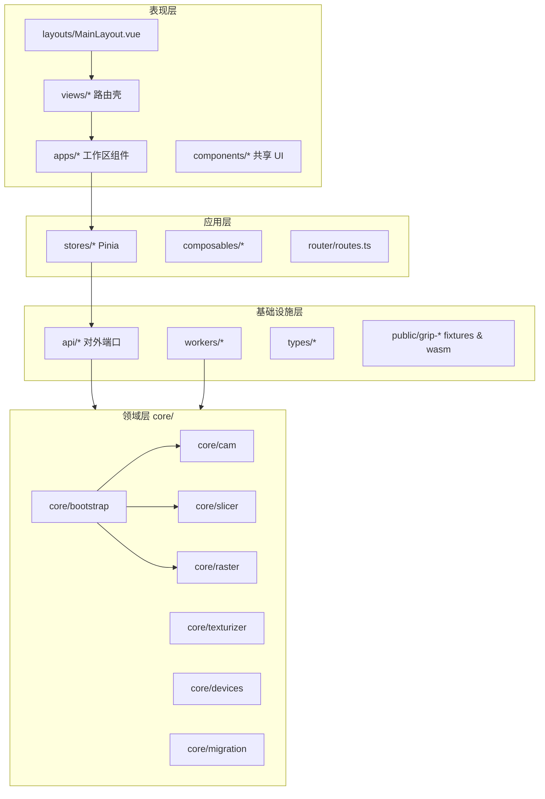
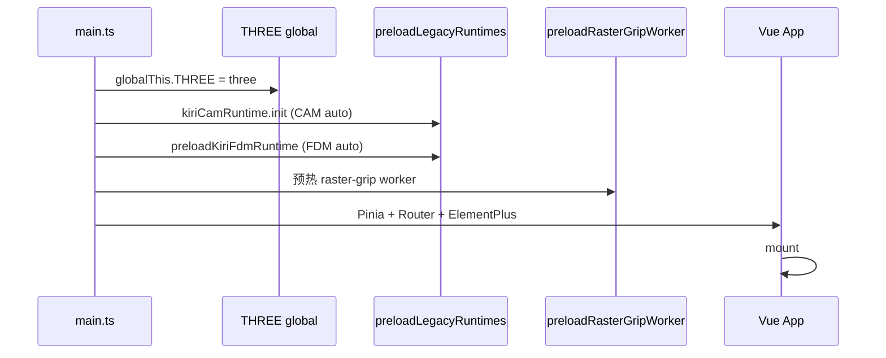
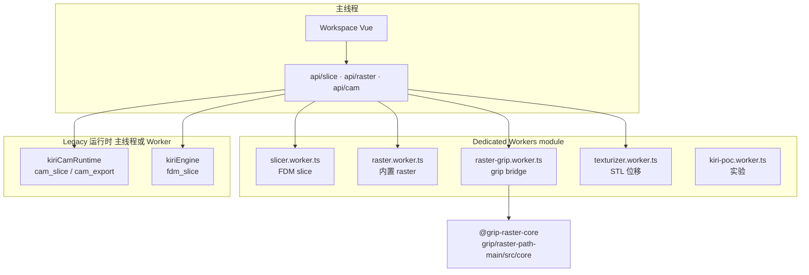
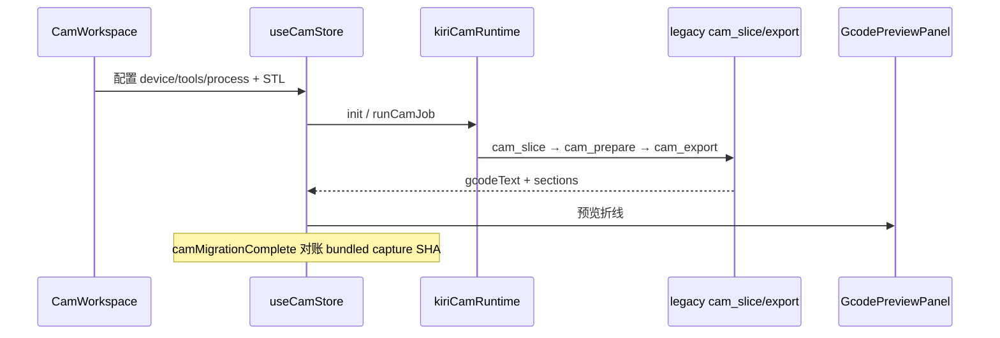
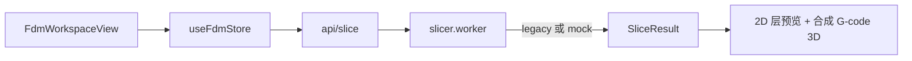
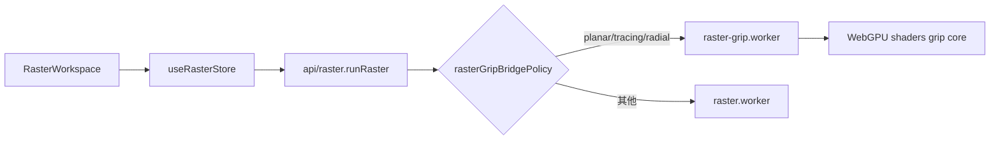
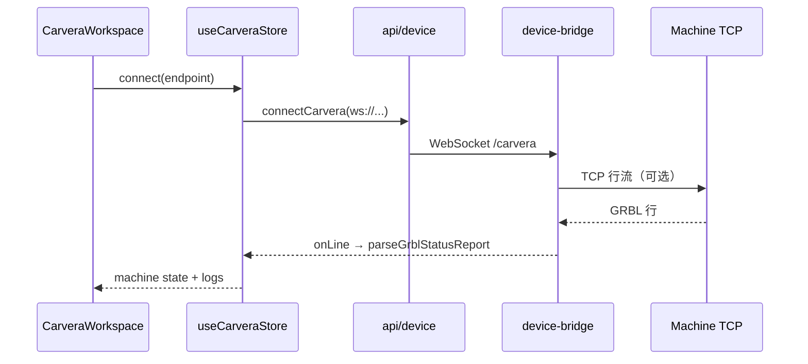
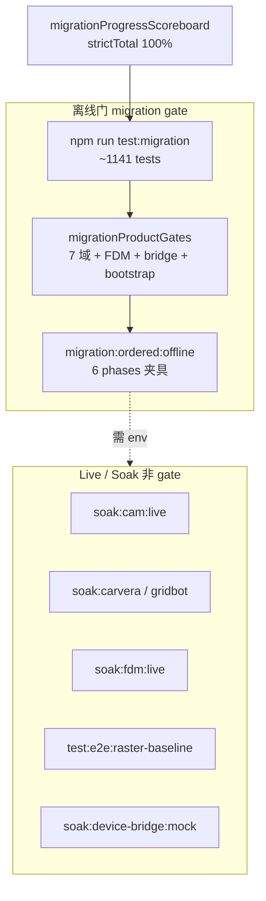
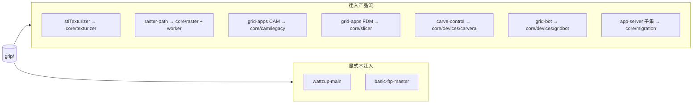
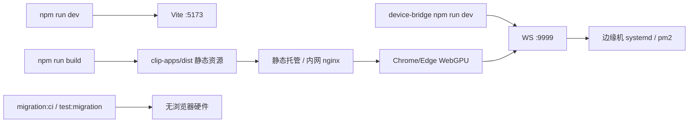

# shape_cam 技术架构

> **范围**：`F:\CAM\chip\shape_cam` 迁移后工程（`clip-apps` + `device-bridge`），及其对上级仓库 `grip/` 的依赖关系。  
> **版本基准**：与当前代码树一致（Vue 3 + Vite 7 + Vitest 4 + Playwright）。

---

## 1. 系统上下文（C4 Context）

shape_cam 是 **grip 多产品线的统一 Web 工作台**：在浏览器内完成 CAM/FDM 刀路、Raster 路径、STL 纹理、以及 Carvera/GridBot 设备控制；通过 **device-bridge** 将 WebSocket 指令桥接到机床 TCP。

```mermaid
flowchart TB
  subgraph users [用户]
    Op[操作员 / 工艺工程师]
  end

  subgraph shape_cam [shape_cam]
    CA[clip-apps<br/>Vue SPA]
    DB[device-bridge<br/>Node WS 服务]
  end

  subgraph grip_repo [上级仓库 grip/ 只读依赖]
    G1[grid-apps-master<br/>Kiri CAM/FDM legacy]
    G2[raster-path-main<br/>WebGPU 核心]
    G3[stlTexturizer-main]
    G4[carve-control-main]
    G5[grid-bot-master]
    G6[app-server / net-level / log-util<br/>契约子集]
  end

  subgraph machines [现场设备]
    CV[Carvera 控制器 TCP]
    GB[GridBot 打印机 TCP]
  end

  Op -->|HTTPS 浏览器| CA
  CA -->|ws://host:port/carvera| DB
  CA -->|ws://host:port/gridbot| DB
  DB -->|mock 或 TCP| CV
  DB -->|mock 或 TCP| GB

  CA -.->|Vite alias / sync 脚本| G1
  CA -.->|@grip-raster-core| G2
  CA -.->|算法与金样| G3
  CA -.->|协议与资产| G4
  CA -.->|协议| G5
  CA -.->|迁移门 stub| G6
```

---

## 2. 仓库与部署单元

| 路径 | 类型 | 运行时 | 职责 |
|------|------|--------|------|
| `shape_cam/clip-apps/` | 前端 SPA | 浏览器（Vite dev / 静态 dist） | 全部业务 UI、领域逻辑、Worker、迁移门测试 |
| `shape_cam/device-bridge/` | 边缘服务 | Node.js（`tsx` / `tsc` 构建） | 双路径 WebSocket → GRBL / Marlin 行协议 |
| `../grip/*` | 源镜像（非 shape_cam 子模块） | 开发期引用 | Legacy bundle、Raster core、fixture、设备协议参考 |

```mermaid
flowchart LR
  subgraph clip_apps [clip-apps]
    Vite[Vite 7 + Vue 3]
    Pinia[Pinia stores]
    Core[core/* 领域]
    Workers[workers/*.worker.ts]
    E2E[Playwright e2e/]
    Vitest[Vitest migration gate]
  end

  subgraph bridge [device-bridge]
    HTTP[http.Server :9999]
    WSC[/carvera WSS]
    WSG[/gridbot WSS]
    Mock[mock backends]
    TCP[tcp backends]
  end

  Vite --> Pinia
  Pinia --> Core
  Core --> Workers
  clip_apps -->|WebSocket| bridge
```

---

## 3. clip-apps 分层架构

采用 **视图薄、核心厚、API 适配** 的分层；迁移对账逻辑集中在 `core/migration`。



### 3.1 目录职责

| 目录 | 说明 |
|------|------|
| `src/views/` | 路由级页面（`FdmView`、`CamView` 等），挂载 `apps/*` 工作区 |
| `src/apps/` | 领域工作区 UI（CAM、Raster、Texturizer、Carvera、GridBot） |
| `src/stores/` | 会话状态、localStorage 持久化、设备连接编排 |
| `src/api/` | Worker 调度、WebSocket 封装、Job CRUD、切片/CAM/Raster 入口 |
| `src/core/` | 纯 TS 领域算法、grip 对账、迁移门、协议解析 |
| `src/workers/` | 后台线程：切片、Raster、纹理、Kiri POC |
| `src/composables/` | Three.js 视口、G-code 预览、导入导出 |
| `e2e/` | Playwright 工作区与 Raster 基线 |
| `scripts/` | grip fixture 同步、迁移 CI、soak 编排 |

---

## 4. 运行时技术栈

| 层次 | 技术 | 用途 |
|------|------|------|
| UI 框架 | Vue 3.5 + Vue Router 5 | SPA、懒加载路由 |
| 组件库 | Element Plus 2.x | 管理台布局、表单、表格 |
| 状态 | Pinia 3 | 各工作区 store |
| 3D | Three.js 0.183 + three-mesh-bvh | CAM/FDM/Carvera 预览、matcap |
| 网格布尔 | manifold-3d | CAM 相关几何（按需） |
| 构建 | Vite 7 + vue-tsc | HMR、别名 `@`、`@grip-raster-core` |
| 单元测试 | Vitest 4（`vitest.migration.ts` 等） | ~1141 迁移门用例 |
| E2E | Playwright | 工作区 smoke、Raster planar 基线 |
| 设备桥 | ws 8.x + Node http | 双设备 WebSocket |
| Legacy | grip grid-apps Kiri bundle | `VITE_KIRI_LEGACY_CAM` / `FDM` |

### 4.1 启动序列（`main.ts`）



---

## 5. 计算架构：Worker 与 Legacy

重计算不阻塞主线程；策略由环境变量与 `kiriRuntimePolicy` 控制。



| Worker / 运行时 | 触发 API | 输入 | 输出 |
|-----------------|----------|------|------|
| `slicer.worker` | `api/slice.submitSliceJob` | Job + FdmProcess + 顶点 | 层预览、G-code、legacy debug |
| `raster.worker` | `api/raster.runRaster` | RasterRequest（非 grip bridge 模式） | RasterResult + GPU 阶段耗时 |
| `raster-grip.worker` | `api/rasterGrip.runRasterGripBridge` | planar/tracing/radial 配置 | 与 grip 路径 SHA 对齐的结果 |
| `texturizer.worker` | `api/texturizer` | STL + 位移参数 | 三角网格 / binary STL |
| Kiri CAM | `core/cam/*` + store | device/tools/process JSON | G-code 段、session bundle |
| Kiri FDM | `core/slicer/*` | 同 slice 管线 | 层路径或 placeholder |

**Vite 别名**（`vite.config.ts`）：

- `@` → `clip-apps/src`
- `@grip-raster-core` → `../../grip/raster-path-main/src/core`（开发期直接编译 grip 核心）

---

## 6. device-bridge 技术架构

单 HTTP 进程监听 `PORT`（默认 **9999**），在 `upgrade` 事件上按 path 分发到两个 `WebSocketServer(noServer)`。

```mermaid
flowchart TB
  subgraph bridge [device-bridge src/main.ts]
    HTTP[createServer]
    UP[upgrade 路由]
    WSC[carveraWss]
    WSG[gridbotWss]
  end

  subgraph carvera_path [/carvera]
    CM[createCarveraMockBackend]
    CT[createTcpLineBackend<br/>CARVERA_TCP]
    Q[pending 队列 max 200]
  end

  subgraph gridbot_path [/gridbot]
    GM[createGridbotMockBackend<br/>M105/M114/Advanced OK]
    GT[createTcpLineBackend<br/>GRIDBOT_TCP]
  end

  Client[clip-apps CarveraConnection / GridBotConnection] -->|WebSocket| HTTP
  HTTP --> UP
  UP -->|pathname /carvera| WSC
  UP -->|pathname /gridbot| WSG
  WSC --> CM
  WSC --> CT
  WSG --> GM
  WSG --> GT
  CT --> CV_TCP[Carvera TCP]
  GT --> GB_TCP[GridBot TCP]
```

| 环境变量 | 含义 |
|----------|------|
| `PORT` | 监听端口（默认 9999） |
| `CARVERA_BACKEND` | `mock` \| `tcp` |
| `CARVERA_TCP` | `host:port` |
| `GRIDBOT_BACKEND` | `mock` \| `tcp` |
| `GRIDBOT_TCP` | `host:port` |

clip-apps 侧：`api/device.ts` 单例 `CarveraConnection` / `GridBotConnection` → `stores/useCarveraStore` / `useGridBotStore` 解析行协议（`grblLineParse`、`gridbotLineParse`、`gridbotAckSendQueue`）。

---

## 7. 数据流（按领域）

### 7.1 CAM 刀路



### 7.2 FDM 切片



### 7.3 Raster



### 7.4 设备控制



---

## 8. 持久化与集成边界

| 存储 | 键/机制 | 内容 |
|------|---------|------|
| `localStorage` | `ws-cam-recent-runs` | CAM 运行快照 |
| `localStorage` | `ws-raster-recent-jobs` | Raster 任务 |
| `localStorage` | `ws-texturizer-recent-jobs` | 纹理任务 |
| `localStorage` | Carvera/GridBot/FDM 各 store 键 | 连接端点、发送选项、作业列表 |
| `public/grip-raster-fixtures/` | 同步脚本 | planar/radial 基线 STL/meta |
| `public/`（CAM/设备） | `sync:grip-*` | WASM、carvera.obj、金样 G-code |

**无服务端数据库**：Jobs/API 层多为浏览器本地或内存 stub；`core/migration/gripAppServer*` 为 **进程内 HTTP stub**，非生产 app-server 部署。

---

## 9. 迁移与质量门禁（技术视图）



| 配置文件 | 作用 |
|----------|------|
| `vitest.migration.ts` | 迁移门测试集（排除 `*.live.spec.ts`） |
| `vitest.golden.ts` | Raster 金样 |
| `vitest.capture.ts` | CAM fixture 捕获 |
| `playwright.config.ts` | E2E |

---

## 10. 外部依赖关系（grip → shape_cam）



---

## 11. 构建与发布视图



**推荐开发环境变量**（见 `migrationEnvManifest.ts`）：

- `VITE_KIRI_LEGACY_CAM=1`
- `VITE_RASTER_GRIP_BRIDGE=1`

---

## 12. 安全与运维要点

- **device-bridge** 默认绑定本机，无鉴权；生产应网络隔离或加反向代理 TLS。
- **路径遍历**：`gripAppServerStaticRoute` 在迁移门中校验 `..` 拒绝（Windows 兼容）。
- **Worker 单例**：Raster worker `inflight` 防并发；测试用 `resetRasterWorkerStateForTests`。
- **端口冲突**：9999 被占用时 `soak:device-bridge:mock` 可自动换临时端口。

---

## 13. 相关文档

| 文档 | 路径 |
|------|------|
| **操作与功能验证** | `docs/OPERATIONS.md` |
| Live soak 手册 | `clip-apps/SOAK.md` |
| 业务架构 | `docs/BUSINESS-ARCHITECTURE.md` |
| 迁移进度报告 | `npm run migration:report` |

---

*文档由 shape_cam 代码结构生成；架构变更时请同步更新本节与 scoreboard `remaining` 字段。*
